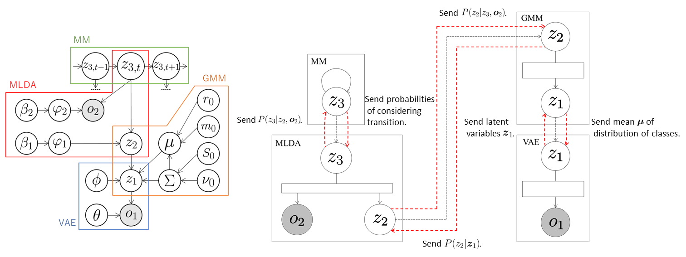

## VAE + GMM + MLDA + MM
In this tutorial, we construct a model that classifies multimodal information considering a transition in an unsupervised manner by integrating VAE, GMM, MLDA, and MM. 

### Data
We use handwritten digit image dataset [MNIST](http://yann.lecun.com/exdb/mnist/) and [Spoken Arabic Digit Data Set](https://archive.ics.uci.edu/ml/datasets/Spoken+Arabic+Digit).
Spoken Arabic Digit DataSet is MFCC features obtained by converting spoken Arabic digits and published in UCI Machine Learning Repository. 
We made multimodal data by pairing the images and speech and, furthermore, sorted them in ascending order like 0, 1, 2, 3, 4, 5, 6, 7, 8, 9, 0, \\( \cdots \\) in order to learn the transition rule.
The number of pairs used in this tutorial is 3000. 
We use HAC features converted from the MFCC features. 
See [here](https://www.isca-speech.org/archive/interspeech_2008/i08_2554.html) the detail of HAC features．


### Model
<!--
VAEは，観測 \\( \boldsymbol{o}_ 1 \\) をエンコーダーにあたるニューラルネットを通して任意の次元の潜在変数 \\( \boldsymbol{z}_ 1 \\)に圧縮し，GMMへ送信する．
GMMは，VAEから送られてきた潜在変数 \\( \boldsymbol{z}_ 1 \\) を分類し，\\( t \\) 番目のデータがクラス \\( z_ {2,t} \\) に分類される確率 \\( P(z_ {2,t} \mid \boldsymbol{z}_ {1,t}) \\) をMLDAへ送信，分類されたクラスの平均 \\( \boldsymbol{\mu} \\) をVAEへ送信する．
VAEは，\\( \boldsymbol{\mu} \\) を用いることでGMMの分類に適した潜在空間が学習する．
MLDAは，GMMから送られてきた確率 \\( P(z_ {2,t} \mid \boldsymbol{z}_ {1,t}) \\) を用いて潜在変数 \\( z_ 2 \\) を観測として扱い， \\( z_ 2 \\) と観測 \\( \boldsymbol{o}_ 2 \\) を分類し，確率 \\( P(z_ {3,t} \mid z_ {2,t}, \boldsymbol{o}_ {2,t}) \\) をMMへ送信，確率 \\( P(z_ {2,t} \mid z_ {3,t}, \boldsymbol{o}_ {2,t}) \\) をGMMへ送信する．
GMMは，送られてきた確率 \\( P(z_ {2,t} \mid z_ {3,t}, \boldsymbol{o}_ {2,t}) \\) も用いて再度分類を行うことで，MLDAの影響を受け \\( z_ 3, \boldsymbol{o}_ 2 \\) を考慮した分類が行われる．
MMは，送られてきた確率 \\( P(z_ {3,t} \mid z_ {2,t}, \boldsymbol{o}_ {2,t}) \\) を用いて繰り返しサンプリングを行い，次のように遷移回数をカウントする．
-->

VAE compresses the observations \\( \boldsymbol{o}_ 1 \\) into the arbitrary dimensional latent variables \\( \boldsymbol{z}_ 1 \\) through the neural network called encoder and sends them to GMM.
GMM classifies the latent variables \\( \boldsymbol{z}_ 1 \\) received from VAE, and then sends the probabilities \\( P(z_ {2,t} \mid \boldsymbol{z}_ {1,t}) \\) that the t-th data is classified into the class \\( z_ {2,t} \\) to MLDA. 
At the same time, it sends the means \\( \boldsymbol{\mu} \\) of the distributions of classes into which each data is classified to VAE.
Therefore, VAE learns the latent space suitable for the classification of GMM by using \\( \mu \\). 
MLDA handles \\( z_ 2 \\) as observations by sampling from the probabilities \\( P(z_ {2,t} \mid \boldsymbol{z}_ {1,t}) \\) received from GMM, and classifies  \\( z_ 2 \\) and the \\( \boldsymbol{o}_ 2 \\). 
After that, MLDA sends the probabilities \\( P(z_ {3,t} \mid z_ {2,t}, \boldsymbol{o}_ {2,t}) \\) to MM and the probabilities \\( P(z_ {2,t} \mid z_ {3,t}, \boldsymbol{o}_ {2,t}) \\) to GMM. 
MM computes the probabilities that \\(z_3\\) are classified into each class based on the transition probabilities, and sends them to MLDA.
MLDA classifies again using the received probabilities, so that the classification is performed in consideration of the data transition.
GMM classifies again using the received probabilities \\( P(z_ {2,t} \mid z_ {3,t}, \boldsymbol{o}_ {2,t}) \\), so that the classification is performed considering \\( z_ 3\\) and \\( o_ 2 \\) under the influence of MLDA.

By the above procedure, the parameters are estimated by affecting each module. 


<div align="center">

</div>

### Codes
First, the necessary modules are imported.

```
import serket as srk
import vae
import gmm
import mlda
import mm
import numpy as np
```

Then, data and correct labels are loaded.
The data is sent as observations to the connected modules by using `srk.Observation`.

```
obs1 = srk.Observation( np.loadtxt( "data1.txt" ) )  # image data
obs2 = srk.Observation( np.loadtxt( "data2.txt" ) )  # audio data
data_category = np.loadrxt( "category.txt" )
```

The modules VAE, GMM, MLDA and MM used in the integrated model are defined.
In the VAE, the dimensions of the latent variables are 18, the number of epochs is 200 and batch size is 500.
In the GMM, the data is classified into 10 classes, and optional argument `data_category` is correct labels and used to compute classification accuracy. 
In the MLDA, the data is classified into 10 classes using the weights `[200,200]` for the modalities, and optional argument `data_category` is correct labels and used to compute classification accuracy. 


```
vae1 = vae.VAE( 18, itr=200, batch_size=500 )
gmm1 = gmm.GMM( 10, category=data_category )
mlda1 = mlda.MLDA( 10, [200,200], category=data_category )
mm1 = mm.MarkovModel()
```

The modules are connected and the integrated model is constructed.

```
vae1.connect( obs1 )  # connect obs1 to vae1
gmm1.connect( vae1 )  # connect vae1 to gmm1
mlda1.connect( obs2, gmm1 )  # connect obs2 and gmm1 to mlda1
mm1.connect( mlda1 ) # connect mlda1 to mm1
```

Finally, the parameters of the whole model are learned by alternately updating the parameters of each module through exchanging messages.

```
for i in range(5):
    vae1.update()  # train vae1
    gmm1.update()  # train gmm1
    mlda1.update()  # train mlda1
    mm1.update()  # train mm1
```

### Result
If training the model is suceeded, `module002_vae`, `module003_gmm`, `module004_mlda`, and `module005_mm` directories are created.
The parameters of each module, probabilities, accuracy, and so on are stored in each directory.
The result and the accuracy of the classification are stored in `module004_mlda`.
The indexes of the classes into which each data is classified are saved in `class_learn.txt`, and the classification accuracy is saved in `acc_learn.txt`.
