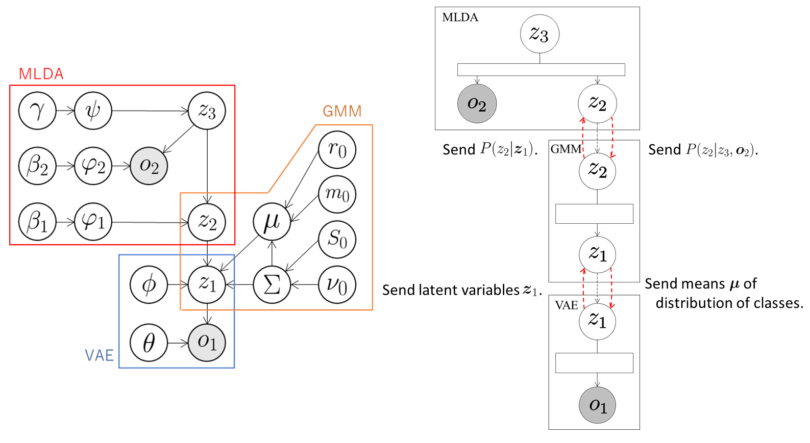

## VAE+GMM+MLDA
In this tutorial, we construct a model that classifies multimodal information in an unsupervised manner by integrating VAE, GMM, and MLDA.

### Data
We use a handwritten digit image dataset [MNIST](http://yann.lecun.com/exdb/mnist/) and a [Spoken Arabic Digit Data Set](https://archive.ics.uci.edu/ml/datasets/Spoken+Arabic+Digit).
The spoken Arabic digit dataset consists of MFCC features obtained by converting spoken Arabic digits; the results are published in the UCI Machine Learning Repository.
To realize multimodal learning, we constructed pairwise data of the images and speech samples.
The number of pairs used in this tutorial is 3,000.
We use HAC features converted from MFCC features.
See [here](https://www.isca-speech.org/archive/interspeech_2008/i08_2554.html) for details of the HAC features.  


### Model

The VAE compresses the observations \\( \boldsymbol{o}_ 1 \\) into arbitrary dimensional latent variables \\( \boldsymbol{z}_ 1 \\) through a neural network called the encoder and sends them to the GMM.
The GMM classifies the latent variables \\( \boldsymbol{z}_ 1 \\) received from the VAE and sends the probabilities \\( P(z_ {2,t} \mid \boldsymbol{z}_ {1,t}) \\) that the t-th data element is classified into the class \\( z_ {2,t} \\) to the MLDA.
At the same time, the GMM sends the means \\( \boldsymbol{\mu} \\) of the distributions of classes into which each data element is classified to VAE.
Therefore, the VAE learns the latent space suitable for the classification of the GMM by using \\( \boldsymbol{\mu} \\).
The MLDA handles \\( z_ 2 \\) as observations by sampling from the probabilities \\( P(z_ {2,t} \mid \boldsymbol{z}_ {1,t}) \\) received from the GMM and classifies \\( z_ 2 \\) and the observations \\( \boldsymbol{o}_ 2 \\).
Next, it sends the probabilities \\( P(z_ {2,t} \mid z_ {3,t}, \boldsymbol{o}_ {2,t}) \\) to the GMM.
The GMM classifies again using the received probabilities \\( P(z_ {2,t} \mid z_ {3,t}, \boldsymbol{o}_ {2,t}) \\) so that the classification is performed considering \\( z_ 3\\) and \\( \boldsymbol{o}_ 2 \\) under the influence of the MLDA.


<div align="center">

</div>

### Codes
First, the necessary modules are imported:

```
import serket as srk
import vae
import gmm
import mlda
import numpy as np
```

Next, data and correct labels are loaded.
The data are sent as observations to the connected modules using `srk.Observation`:

```
obs1 = srk.Observation( np.loadtxt( "data1.txt" ) )  # image data
obs2 = srk.Observation( np.loadtxt( "data2.txt" ) )  # speech data
data_category = np.loadrxt( "category.txt" )
```

The modules VAE, GMM, and MLDA used in the integrated model are then defined.
In the VAE, the number of dimensions of the latent variables is 18, the number of epochs is 200, and the batch size is 500.
In the GMM, the data are classified into ten classes.
The optional argument `data_category` is a set of correct labels used to compute classification accuracy.
In the MLDA, the data are classified into ten classes using the weights `[200,200]` for the modalities.
The optional argument `data_category` is a set of correct labels used to compute classification accuracy.


```
vae1 = vae.VAE( 18, itr=200, batch_size=500 )
gmm1 = gmm.GMM( 10, category=data_category )
mlda1 = mlda.MLDA( 10, [200,200], category=data_category )
```

The modules are then connected and the integrated model is constructed:

```
vae1.connect( obs1 )  # connect obs1 to vae1
gmm1.connect( vae1 )  # connect vae1 to gmm1
mlda1.connect( obs2, gmm1 )  # connect obs2 and gmm1 to mlda1
```

Finally, the parameters of the whole model are learned by alternately updating the parameters of each module through exchanging messages:

```
for i in range(5):
    vae1.update()  # train vae1
    gmm1.update()  # train gmm1
    mlda1.update()  # train mlda1
```

### Result
If model training is successful, then the `module002_vae`, `module003_gmm`, and `module004_mlda` directories are created.
The parameters of each module, probabilities, accuracy, and so on are stored in each directory.
The results and accuracy of the classification are stored in `module004_mlda`.
The indices of the classes into which each data element is classified are saved in `class_learn.txt` and the classification accuracy is saved in `acc_learn.txt`.
