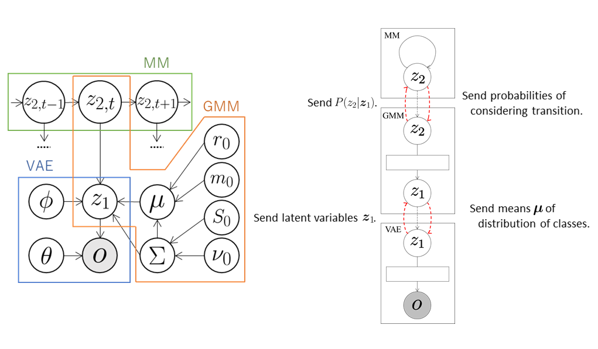

## VAE+GMM+MM
A hidden Markov model (HMM) can be constructed by combining a Gaussian mixture model (GMM) and a Markov model (MM).
Here, we extend the GMM+VAE, which enables unsupervised classification using dimensional compression, and construct a model of unsupervised classification that can learn transition rules by integrating VAE, GMM, and MM.

### Data
We use a handwritten digit image dataset [MNIST](http://yann.lecun.com/exdb/mnist/).
The number of data elements is 3,000.
In order to learn the transition rules, we sort them in ascending order, e.g., 0, 1, 2, 3, 4, 5, 6, 7, 8, 9, 0, \\( \cdots \\).

### Model

The VAE compresses the observations \\( \boldsymbol{o} \\) into arbitrary dimensional latent variables \\( \boldsymbol{z}_ 1 \\)  through a neural network called the encoder and sends them to the GMM.
The GMM classifies the latent variables \\( \boldsymbol{z}_ 1 \\) received from the VAE and sends the probabilities \\( P(z_ {2,t} \mid \boldsymbol{z}_ {1,t}) \\) that the t-th data element is classified into the class \\( z_ {2,t} \\) to MM.
At the same time, the GMM sends the means \\( \boldsymbol{\mu} \\) of the distributions of classes into which each data element is classified to the VAE.
Therefore, the VAE learns the latent space suitable for the classification of the GMM using \\( \boldsymbol{\mu} \\).
Moreover, transition rules are learned in the MM.
The latent variables \\( z_ 2 \\) are repeatedly sampled using the received probabilities \\( P(z_ {2,t} \mid \boldsymbol{z}_ {1,t}) \\) and the number of transitions is counted as follows:

$$
\begin{align}
&z'_ 2 \sim P(z_{2,t} \mid \boldsymbol{z}_{1,t})\\
&z_2 \sim P(z_{2,t+1} \mid \boldsymbol{z}_{1,t+1})\\
&N_{z'_ 2,z_2}++.
\end{align}
$$

The transition probabilities \\( P(z_ 2 \mid z'_ 2) \\) can be computed from these values as follows:

$$
P(z_2 \mid z'_ 2) = \frac{N_{z'_ 2,z_2} + \alpha}{\sum_{\bar{z}_2}{N_{z'_ 2,\bar{z}_2}} + K \alpha},
$$

where \\( K \\) is the number of classes.
The MM computes the probabilities that \\( z_ 2 \\) are classified into each class based on the transition probabilities and sends them to GMM.
The GMM classifies again using the received probabilities so that the classification is performed in consideration of the data transition.


<div align="center">

</div>

### Codes
First, the necessary modules are imported:

```
import serket as srk
import vae
import gmm
import mm
import numpy as np
```

Next, data and correct labels are loaded.
The data are sent as observations to the connected module using `srk.Observation`:

```
obs = srk.Observation( np.loadtxt( "data.txt" ) )
data_category = np.loadrxt( "category.txt" )
```

The modules VAE, GMM, and MM used in the integrated model are then defined.
In the VAE, the number of dimensions of the latent variables is 18, the number of epochs is 200, and the batch size is 500.
In the GMM, the data are classified into ten classes.
The optional argument `data_category` is a set of correct labels used to compute classification accuracy.

```
vae1 = vae.VAE( 18, itr=200, batch_size=500 )
gmm1 = gmm.GMM( 10, category=data_category )
mm1 = mm.MarkovModel()
```

The modules are then connected and the integrated model is constructed:

```
vae1.connect( obs )  # connect obs to vae1
gmm1.connect( vae1 )  # connect vae1 to gmm1
mm1.connect( gmm1 )  # connect gmm1 to mm1
```

Finally, the parameters of the whole model are learned by alternately updating the parameters of each module through exchanging messages:

```
for i in range(5):
    vae1.update()  # train vae1
    gmm1.update()  # train gmm1
    mm1.update()  # train mm1
```

### Result
If model training is successful, then the `module001_vae`, `module002_gmm`, and `module003_mm` directories are created.
The parameters of each module, probabilities, accuracy, and so on are stored in each directory.
The results and accuracy of the classification are stored in `module002_gmm`.
The indices of the classes into which each data element is classified are saved in `class_learn.txt` and the classification accuracy is saved in `acc_learn.txt`.
