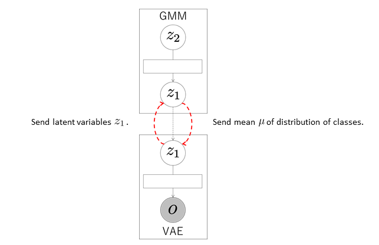
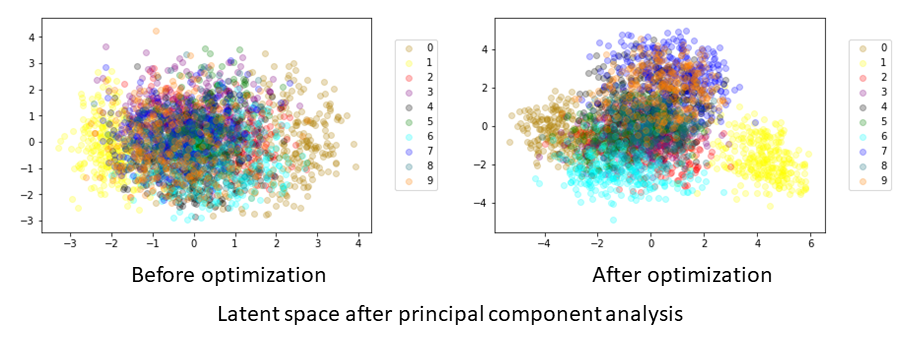

## VAE+GMM
In this tutorial, we construct a model of unsupervised classification using dimensional compression by integrating VAE and GMM.

### Data
We use a handwritten digit image dataset [MNIST](http://yann.lecun.com/exdb/mnist/).
The number of data elements is 3,000.

### Model

In the VAE, the observations \\( \boldsymbol{o} \\) are compressed into arbitrary dimensional latent variables \\( \boldsymbol{z}_1 \\) through a neural network called the encoder.
Next, the latent variables \\( \boldsymbol{z}_1 \\) are reconstructed into the original dimensional observations through a neural network called the decoder.
The parameters are learned so that the reconstructed values become the same as the observations \\( \boldsymbol{o} \\).

In this integrated model, the VAE sends the latent variables \\( \boldsymbol{z}_1 \\) to the GMM.
The GMM classifies the latent variables \\( \boldsymbol{z}_1 \\) received from the VAE and computes the means \\( \boldsymbol{\mu} \\) of the distributions of classes into which each data element is classified.
These means are sent to the VAE, which updates its parameters using these means.
The variational lower bound of a normal VAE is as follows:

$$
\mathcal{L}( \boldsymbol{\theta}, \boldsymbol{\phi}; \boldsymbol{o} ) = -D_{KL} ( q_{ \boldsymbol{\phi} }( \boldsymbol{z}_1 \mid \boldsymbol{o} ) \| \mathcal{N} ( 0, \boldsymbol{I} ) ) + \mathbb{E}_{ q_{ \boldsymbol{\phi} }( \boldsymbol{z}_1 \mid  \boldsymbol{o} ) } [ \log{ p_{ \boldsymbol{\theta} } ( \boldsymbol{o} \mid \boldsymbol{z}_1 ) } ].
$$

In Serket, in order for the VAE and GMM are affected each other, we define the variational lower bound as follows using the means \\( \boldsymbol{\mu} \\) of the distributions of classes into which each data element is classified:

$$
\mathcal{L}( \boldsymbol{\theta}, \boldsymbol{\phi}; \boldsymbol{o} ) = - \alpha D_{KL} ( q_{ \boldsymbol{\phi} } ( \boldsymbol{z}_1 \mid \boldsymbol{o} ) \| \mathcal{N} ( \boldsymbol{\mu}, \boldsymbol{I} ) ) + \mathbb{E}_{ q_{ \boldsymbol{\phi} } ( \boldsymbol{z}_1 \mid \boldsymbol{o} ) } [ \log{ p_{ \boldsymbol{\theta} } ( \boldsymbol{o} \mid \boldsymbol{z}_1 ) } ],
$$

where \\( D_{KL} \\) represents KL divergence and \\( \alpha \\) is the weight of KL divergence.
In this tutorial, we use \\( \alpha = 1 \\).
As a result, the latent variables \\( \boldsymbol{z}_1 \\) of the data classified into the same class by the GMM have similar values, and the latent space suitable for the classification is learned.


<div align="center">

</div>

### Codes
First, the necessary modules are imported:

```
import serket as srk
import vae
import gmm
import numpy as np
```

Next, data and correct labels are loaded.
The data are sent as observations to the connected module using `srk.Observation`:

```
obs = srk.Observation( np.loadtxt( "data.txt" ) )
data_category = np.loadtxt( "category.txt" )
```

The modules VAE and GMM used in the integrated model are then defined.
In the VAE, the number of dimensions of the latent variables is 18, the number of epochs is 200, and the batch size is 500.
In the GMM, the data are classified into ten classes.
The optional argument `data_category` is a set of correct labels used to compute classification accuracy.

```
vae1 = vae.VAE( 18, itr=200, batch_size=500 )
gmm1 = gmm.GMM( 10, category=data_category )
```

The modules are then connected and the integrated model is constructed:

```
vae1.connect( obs )  # connect obs to vae1
gmm1.connect( vae1 )  # connect vae1 to gmm1
```

Finally, the parameters of the whole model are learned by alternately updating the parameters of each module through exchanging messages:

```
for i in range(5):
    vae1.update()  # train vae1
    gmm1.update()  # train gmm1
```

### Result
If model training is successful, then the `module001_vae` and `module002_gmm` directories are created.
The parameters of each module, probabilities, accuracy, and so on are stored in each directory.
The compressed latent variables are stored in `z_learn.txt` in `module001_vae`.
An example of a graph plotting the latent variables \\( \boldsymbol{z}_1 \\) compressed into two dimensions by principal component analysis is shown below.

<div align="center">

</div>

The data points that are the same class are widely dispersed in the space before optimization, whereas they have similar values for each class after optimization.
It is confirmed that the latent space suitable for the classification is learned through exchanging messages between the GMM and VAE.
The results and accuracy of the classification are stored in `module002_gmm`.
The indices of the classes into which each data element is classified are saved in `class_learn.txt` and the classification accuracy is saved in `acc_learn.txt`.
